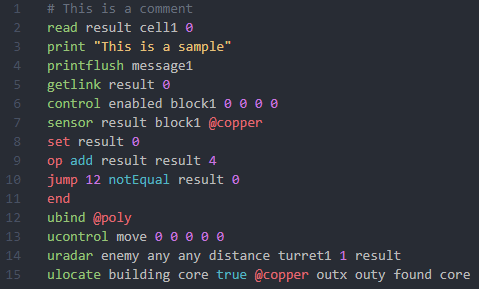

# Mindustry Logic for VS Code

Mindustry Logic (`mlog`) language support for Visual Studio Code.

I really like Mindustry and the introduction of `mlog` in v6.0 was a great addition. Unfortunately, I really don't like the in-game editor, so I made this extension to hopefully make the coding process easier.

## Features

- Highlighting for `mlog` files

### Highlighting Sample

_Theme: [One Monokai Theme](https://marketplace.visualstudio.com/items?itemName=azemoh.one-monokai)_

## To-Do

- Create a language/compiler to convert more traditional style code into `mlog`

    _No promises on when this is coming_

## Changelog

See the changelog [here](https://github.com/Antyos/vscode-mlog/blob/main/CHANGELOG.md).

## Contributing

If you would like to contribute, here's what you can do:

1. Fork the repository: <https://github.com/Antyos/vscode-mlog.git>
2. Run `npm install` to download node modules
3. Rename `.vscode/launch-template.json` to `.vscode/launch.json`
4. Make changes
5. Submit a pull request!
